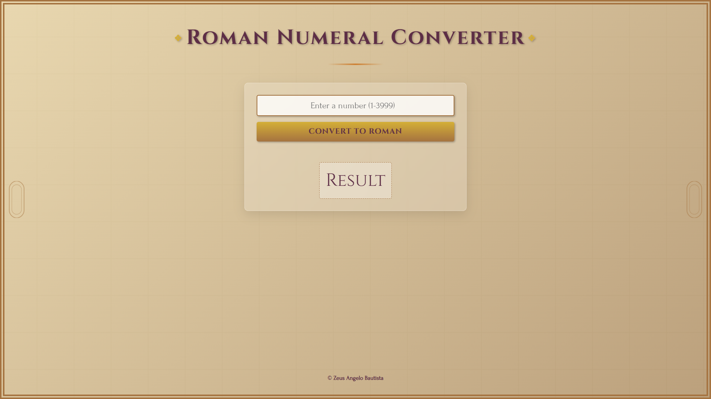

# 🔢 Roman Numeral Converter

## 📸 Screenshot  

  
---

## 📘 Overview  
This is a clean and functional **Roman Numeral Converter** web app that converts numbers between Roman numerals and standard integers. It's inspired by a classic JavaScript project and enhanced with a modern design and clear code comments to help with learning and reference.

---

## 🚀 Features  
- Converts **integers to Roman numerals** (e.g., `42` ➜ `XLII`)  
- Converts **Roman numerals to integers** (e.g., `XLII` ➜ `42`)  
- Validates user input and handles edge cases  
- Real-time conversion on button click or Enter key  
- Minimalist and responsive UI  
- Stylish design with smooth UX  

---

## 💻 How to Use  
1. Type a number (1–3999) or a Roman numeral in the input field.  
2. Click the **"Convert"** button or press **Enter**.  
3. The converted value will appear instantly below the input.  

---

## 🛠️ Technologies Used  
- **HTML5** – Page structure  
- **CSS3** – Modern, responsive design with a clean layout  
- **JavaScript** – Conversion logic and event handling  

---

## 📝 Future Improvements  
- Add **copy-to-clipboard** functionality for results  
- Improve input validation and feedback  
- Add **dark mode** toggle  
- Animate the result display  
- Expand support to handle lowercase Roman input  

---

Thanks for checking it out! 🎉  
Feel free to fork, clone, or contribute!
